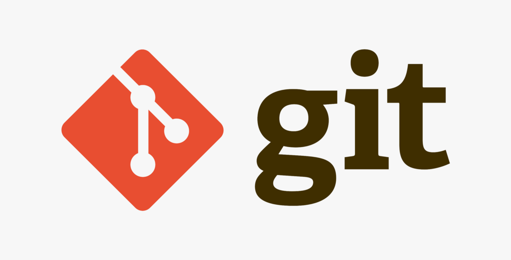
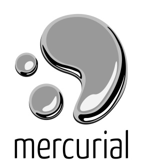
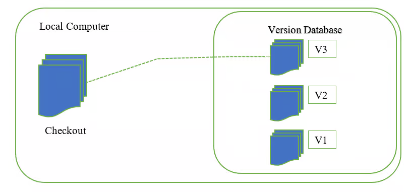

# Git and GitHub, Version Control Systems
**[Next: 2 - Computer Hardware](../002%20-%20Computer%20Hardware/)**
***

This project is currently located on a GitHub[*](https://en.wikipedia.org/wiki/GitHub)[*](https://github.com/) hosted repository and I use GitHub Desktop to work with this repository. For some this may be a familiar name, but for some not. For any developer it is crucial to know what are these, as they make teamwork and personal project extremely easy to share between team members and even personal devices. So here I will explain what are GitHub and Git and what is difference between them.

 

## Version Control System(s) (VSC)
Before diving into Git and GitHub discussion topic, we need to know what VCSs are. What is a VCS you may ask? VSC is a tool that helps to manage versions of your project(s). We can take a videogame mechanic as a simple example: Before beating a boss in a video game you save your current progress. Then after beating the boss, you save your progress again after success, or load that one previous save to restore progress and try again with different method. That's how VCSs work. They help you to create versions of your projects and manage them. If you'd have and issue in your current version of the project, you can revert changes to previous version where everything is stable, or you upload a new version to save when everything is functioning after new code update.

Besides of controlling versions VCSs also register who have made certain changes in a project so that if somebody has any claims to certain changes they can see who they're gonna adress them to.

There is 2 types of VCSs: **centralized** and **distributed**      (you can also read more about version control in general [here](https://en.wikipedia.org/wiki/Distributed_version_control))

 

**Centralized** VCSs use a remote server (note: remote server are **not** specifically internet hosted. It can be a remote server on a *local network*) to store all project data, while users commit certain file updates load copies of files to work on them locally, commiting them later on. To copy file on your computer can be also called to *check out* or *to update*, since you can already a copy of certain file, you just want to update it if file has been changed by somebody else.

There's also **2 checkout types**:
- **Full checkout**, when user downloads entire project from repository. Makes it easier for user to work offline but can take up a lot of memory space.
- **Partial checkout**, which is, if you my have guessed yet, when user downloads only certain files of project that user has to work with. Vice versa: takes up less space but makes it hard to work offline.

Centralized VCSs are used for massive projects, that would be be impossible or extremely hard to have locally. Large enterprices, government bodies and gaming studios use this type of VCS.

Though with such advantage of being able to store large amounts of data, centralized VCSs have a big and important issue - single point of failure. If a server goes down, files get corrupted or data is being lost, nobody will have access to the project anymore. So while using centralized VCS it is important to maintain servers well and have backups of project somewhere else, for example on another server.

Examples of centralized VCSs:     
- *Subversion (SVN)[*](https://en.wikipedia.org/wiki/Apache_Subversion)[*](https://subversion.apache.org/)*
- *Concurrent Version System (CVS)[*](https://en.wikipedia.org/wiki/Concurrent_Versions_System)[*](https://cvs.nongnu.org/) (it is obsolete and rarely used nowadays)*
- *Perforce[*](https://en.wikipedia.org/wiki/Perforce)[*](https://www.perforce.com/)*

 

**Distributed** VCSs, similar to centralized, use a remote server to keep a repository, except all users download a *copy* of this repository for themselves to work on it locally. Then during work users update their own version of repository - they  *commit* changes. After getting all the needed work done, user then *pushes* them to remote repository, updating it. Users can also *pull* any new changes that's been made to remote repository to *update* their local repository to the latest version with all the changes.

Examples of distributed VCSs:     
- *Git[*](https://en.wikipedia.org/wiki/Git)[*](https://git-scm.com/)*
- *Mercurial[*](https://en.wikipedia.org/wiki/Mercurial)[*](https://www.mercurial-scm.org/)*
- *Fossil[*](https://en.wikipedia.org/wiki/Fossil_(software))[*](https://fossil-scm.org/home/doc/trunk/www/index.wiki)*

 

There also exist **local** VCS, where version storage simply lies on user's own computer.      Usually in that case file management is manual, by using folders, but there is software that allows local version control. Such one being *Revision Control System (RCS)[*](https://en.wikipedia.org/wiki/Revision_Control_System)*.

 

## Git and GitHub

Now that you know what VCSs are and how they function, you do know what Git is - a *distribute VCS*. There won't be explanation about how to use Git, but a discussion about Git and GitHub. (Though you are welcome to investigate it on your own as there are many YouTube tutorials on how to use it.)

Now the common assumption is that GitHub and Git are the same, as it may appear, but it is completely wrong. **GitHub is a repository hosting platform**. All that GitHub does is to provide remote internet servers to host repositories for Git. But it doesn't mean that Git and GitHub depend on each other. You *don't need* to have an online repository in order to work with it on Git. Instead, you can have one locally, for example if your organisation has all computers connected to a single local network and there is a local server that stores a repository.

Another thing - *GitHub Desktop*. While sounds just like GitHub, it is not your personal GitHub hosting. GHD (I'll relate to GitHub Desktop like this from now on) is actually Git, just with visual interface for it! Though, even if it is Git with a GUI (Graphics User Interface) shell, it does not import terminal functions with it, so you may be left without some extra features that original Git has to offer.

GHD is an official GUI shell for Git, but there are also plenty of other unofficial shells that you can find online, few of them being quite popular open-source like *GitKraken[*](https://en.wikipedia.org/wiki/GitKraken)[*](https://www.gitkraken.com/)*, *Sourcetree[*](https://www.sourcetreeapp.com/)* and *SmartGit[*](https://www.smartgit.dev/)*. Be aware, that some of them don't allow, or allow paid commercial use.

***
**[Next: 2 - Computer Hardware](../002%20-%20Computer%20Hardware/)**